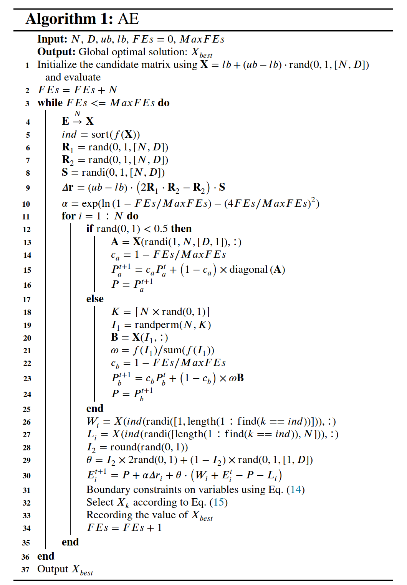
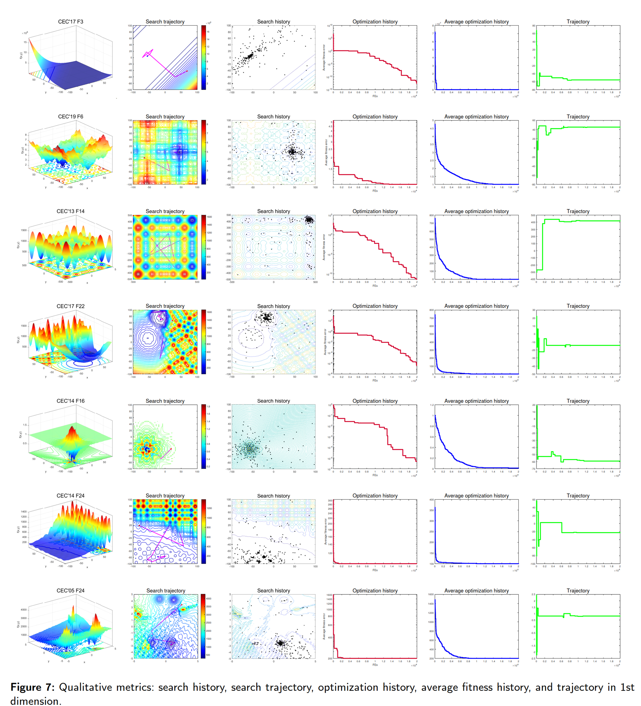
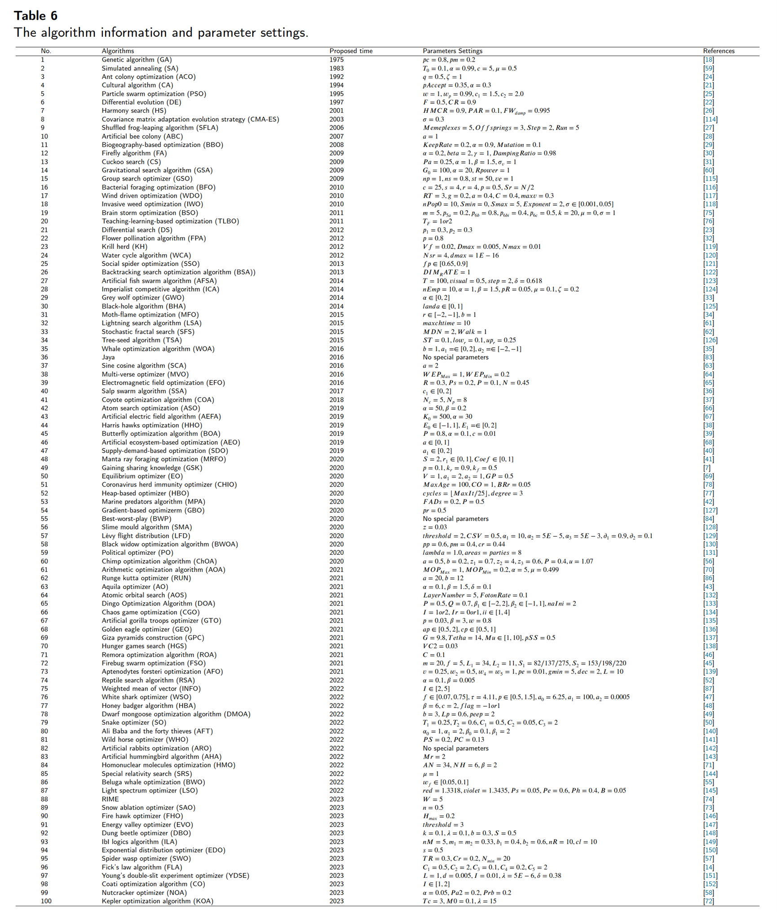

# AlphaEvolution
**Alpha Evolution**: A simple and powerful optimization algorithm to promote optimization beyond metaphors

```
 Authors：Hao Gao(1), Qingke Zhang*(1), Zhi-Hui Zhan(2), Huaxiang Zhang(1)
```

(1) School of Information Science and Engineering, Shandong Normal University, Jinan 250358, China

(2) School of Computer Science and Engineering, South China University of Technology, Guangzhou 510641, China

Corresponding Author: **Qingke Zhang** , Email: tsingke@sdnu.edu.cn , Tel :  +86-13953128163

## 1. AE Introduction
Intelligent optimization algorithms are efficient stochastic search techniques widely used to solve
real-world optimization problems. However, they are limited by their ability to extract and utilize
efficient evolutionary information hidden in the candidate solutions. Moreover, they often use
multiple operators to update solutions, which may make the search more complex. To solve these
problems effectively, this work proposes a novel intelligent optimization algorithm called alpha
evolution (AE). In AE, the unique core operator is designed to generate new candidate solutions
based on matrices.AE is compared with 100 optimization algorithms on the
CEC’17 test suite. The results were validated in terms of convergence and statistical significance.
Furthermore, it was applied to multiple sequence alignment and engineering design problems
to verify its practical value. The evidence indicates that AE is competitive in exploration,
exploitation, convergence ability, and escaping local optima.

The source code of the AE algorithm is publicly available at [https://github.com/tsingke/AlphaEvolution](https://github.com/tsingke/AlphaEvolution).

 

## 2. AE Pseudocode (MATLAB)



## 3. AE Search Behavior Overview



## 4. A List of one hundred compared algorithms



## 5. The MATLAB Code of AE
```MATLAB
function [gbestx,gbestfitness,gbesthistory]=AE(N,D,ub,lb,MaxFEs,Func,FuncId)
% Algorithm Name: Alpha Evolution Algorithm (AE).
% gbestx: The global best solution ( gbestx = [x1,x2,...,xD]).
% gbestfitness: Record the fitness value of global best individual.
% gbesthistory: Record the history of changes in the global optimal fitness.
%---------------------------------------------------------------------------
%Initialization
FEs=0;

X=zeros(N,D);
R=X;
W=X;
newE=X;

f=inf(1,N);
gbesthistory=inf(1,MaxFEs);

%Building the candidate matrix
X=lb+(ub-lb).*rand(N,D);

for i=1:N
    f(i)=Func(X(i,:)',FuncId);
    FEs=FEs+1;
end

[gbestfitness,mi]=min(f);
gbestx=X(mi,:);
gbesthistory(1:FEs)=gbestfitness;

Pa=lb+(ub-lb).*rand(1,D);
Pb=lb+(ub-lb).*rand(1,D);
%---------------------------------------------------------------------------
while FEs<=MaxFEs
    %Sampling evolution matrix
    k=randi(N,N,1);
    E=X(k,:);
    [~,ind]=sort(f);
    R1=rand(N,D);R2=rand(N,D);S=randi([0,1],N,D);
    r=(ub-lb).*(2*R1.*R2-R2).*S;
    %Computing alpha
    alpha=exp(log(1-FEs/MaxFEs)-(4*(FEs/MaxFEs))^2);
    ar=alpha.*r;
    for i=1:N
        cab=FEs/MaxFEs;
        %Sampling W and L
        R(i,:)=X(ind(randi([1,length(1:find(k(i)==ind))])),:);
        W(i,:)=X(ind(randi([length(1:find(k(i)==ind)),N])),:);
        %Building evolutionary paths
        if rand<0.5
            A=X(randi(N,D,1),:);
            Pa=(1-cab)*Pa+cab*diag(A)';
            Ov=Pa;
        else
            K=ceil(N*rand);
            I1=[];I1=randperm(N,K);
            w=[];w=f(I1)./sum(f(I1));
            B=[];B=X(I1,:);
            Pb=(1-cab)*Pb+cab*(w*B);
            Ov=Pb;
        end
        I2=round(rand);
        sita=[];sita=I2*rand(1,D)+(1-I2)*rand*2;
        
        %AE Core operator
        newE(i,:)=Ov+ar(i,:)+sita.*(R(i,:)+E(i,:)-Ov-W(i,:));
        
        %Boundary constraint
        flagub=newE(i,:)>ub;flaglb=newE(i,:)<lb;
        newE(i,flagub)=(E(i,flagub)+ub)/2;newE(i,flaglb)=(E(i,flaglb)+lb)/2;
        newf=Func(newE(i,:)',FuncId);
        FEs=FEs+1;
        %Selection
        if newf<=f(k(i))
            f(k(i))=newf;
            X(k(i),:)=newE(i,:); 
            if f(k(i))<=gbestfitness
                gbestfitness=f(k(i));
                gbestx=X(k(i),:);
            end
        end
        gbesthistory(FEs)=gbestfitness;
    end
    if mod(FEs, MaxFEs/D)==0
        fprintf("AE, FEs: %d, fitess error = %e\n",FEs,gbestfitness);
    end
end % end while
%---------------------------------------------------------------------------
gbesthistory=gbesthistory(1:MaxFEs);
end
```
`Note: This paper has been submitted to Elseviewer Journal "Information Sciences".
The source code mentioned in the paper is only for the purpose of article review and cannot be used for any other purposes without the authors' specific prior written permission.`


## 6. Acknowledgements

**We would like to express our sincere gratitude to the anonymous reviewers for taking the time to review our paper.** 

This work is supported by the National Natural Science Foundation of China (No. 62006144) , the Major Fundamental Research Project of Shandong, China(No. ZR2019ZD03) , and the Taishan Scholar Project of Shandong, China (No.ts20190924).


